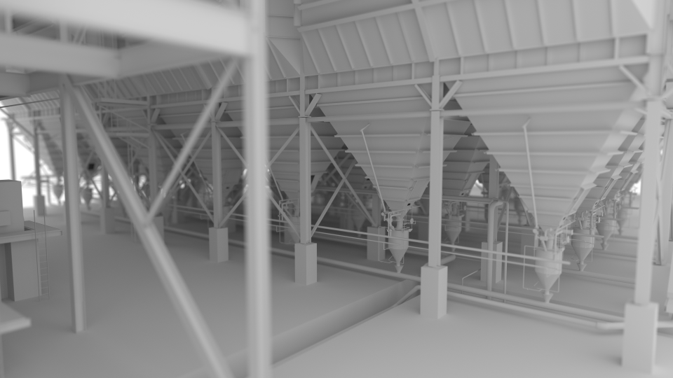

# ProtoRay - Support for Windows CUDA OptiX builds
Quick and dirty fixes to support Windows CUDA OptiX builds - work in progress. OptiX default search path set to version 5.1.1 - project uses OptiX Prime API.

<p align="center"></p>
<p align="center">**Diffuse Path Tracing - San Miguel**</p>
<p align="center"></p>
<p align="center">**Diffuse Path Tracing - Power Plant**</p>

## Requirements
 - [TBB](https://www.threadingbuildingblocks.org/) - Threading Building Blocks
 - CMake
 - CUDA and OptiX
 - extract mesh files (7z e sanmiguel.7z and 7z e powerplant.7z)

## Compile, build and run
```
set TBB_ROOT=<my_tbb_install_dir>
set PATH=%PATH%;C:\ProgramData\NVIDIA Corporation\OptiX SDK 5.1.1\bin64;%TBB_ROOT%\bin\intel64\vc14;

git clone https://github.com/Woking-34/embree-benchmark-protoray.git protoray
cd protoray
mkdir protoray-build
cd protoray-build
cmake .. -G"Visual Studio 15 2017 Win64" -DCUDA_SUPPORT=1
cmake --build . --target protoray --config Release

cd ..
cd protoray-bin
cd Release
protoray.exe render ../../benchmark/sanmiguel/sanmiguel.mesh -no-mtl -r diffuse -size 1280,720 -dev cuda -a optix -spp 64
protoray.exe render ../../benchmark/powerplant/powerplant.mesh -no-mtl -r diffuse -size 1280,720 -dev cuda -a optix -spp 64
```

## Benchmark results - 3840x2160 - OptiX 5.1 - OptiX Prime API
<p align="center">
")
</p>

## Todos
 - Re-enable Linux support
 - Fix OptiX 6.0 performance degradation on RTX GPUs
 - Support for RTX/Turing acceleration (GeometryTriangles API)
 - More robust CMake FindOptiX support (OPTIX_find_api_library(optix 51) vs OPTIX_find_api_library(optix 6.0.0))
 - More sample scenes